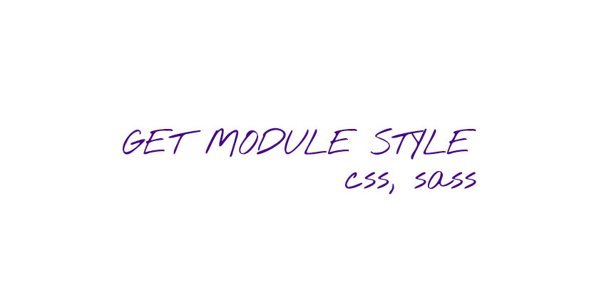

# GetModuleStyle
NPM Package, that helps you use modules css in your code.

<div style="display: flex; justify-content: center; padding-bottom: 15px">
<!--  -->
    
</div>

 <!-- version -->
 <!-- size -->
 <!-- downloads -->
 <!-- licence -->

## Before this package
Always have to write styles["class"] and join it with "" + "" or `${} ${}`. So awful!

``` ts
import * as styles from "./styles.module.scss";

<span className={`${styles["text"]} ${styles["text_big"]} ${styles["text_marked"]}`}>
Big marked text here...
</span>
```

## After
Just import the lib!

``` tsx
import * as styles from "./styles.module.scss";
import { createModuleStylesConverter } from "get-module-style"

// getStyle
const gs = createModuleStylesConverter(styles);

<span className={gs("text text_big text_marked")}>Big marked text here...</span>
```

## Install
:package: To install this package use npm

    npm i get-module-style

## Contributing
Want to collaborate or change the package? 
:octocat: <a href="https://github.com/Kostayne/get-module-style">Check my github</a>